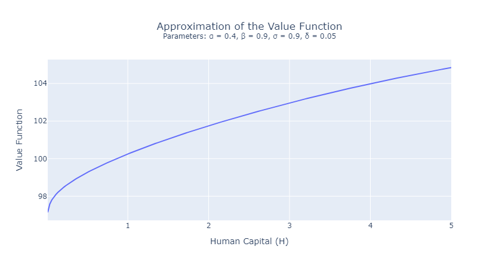

# Dynamic Programming & Reinforcement Learning applied to a Neo-Classical Growth Model

This project solves an optimal growth model using Dynamic Programming techniques by approximating iteratively the value function. It also involves <b>evaluating arbitrary policies</b> on the agent control variable, and produce a Reinforcement Learning algorithm of <b>greedy procedure to update the policy function</b> of the agent.

Additionally, this project <b>calibrates a Neural Network that approximates the optimal path </b> of capital accumulation from an arbitrary amount of capital.

## 1. Model

Consider an agent who allocates her time between producing the consumption good C, and accumulating human capital H. The agent seeks to maximize her discounted utility, as captured by the following objective:

The production function reads in (i).
Normalizing the labor supply of the agent to one, the accumulation law for human capital is given by (ii), where 𝛿 is the depreciation rate of human capital, while 𝐿t is the share of the labor supply dedicated to the production of the consumption good.

We assume a CRRA Utility function: U(C) = C^(1-𝜎)/(1-𝜎).

## 2. Value function and optimal policy
The Bellman Equation of the agent is:

I iteratively approximate the value function, reached by the following optimal policy function:

##
